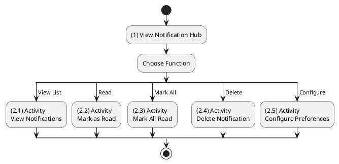
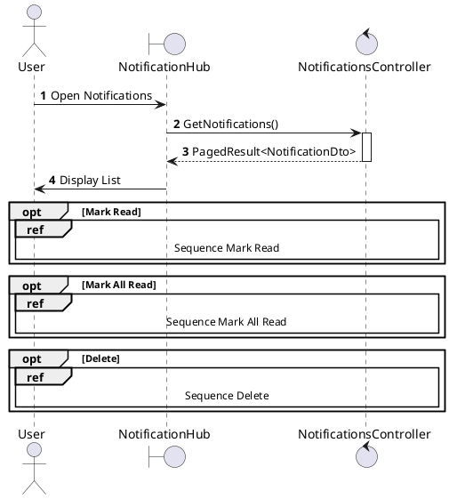
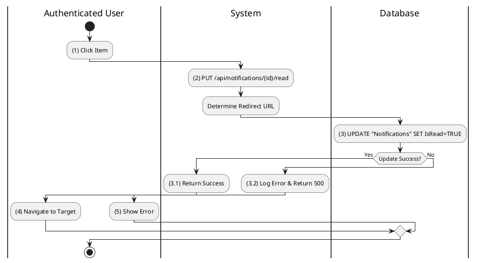
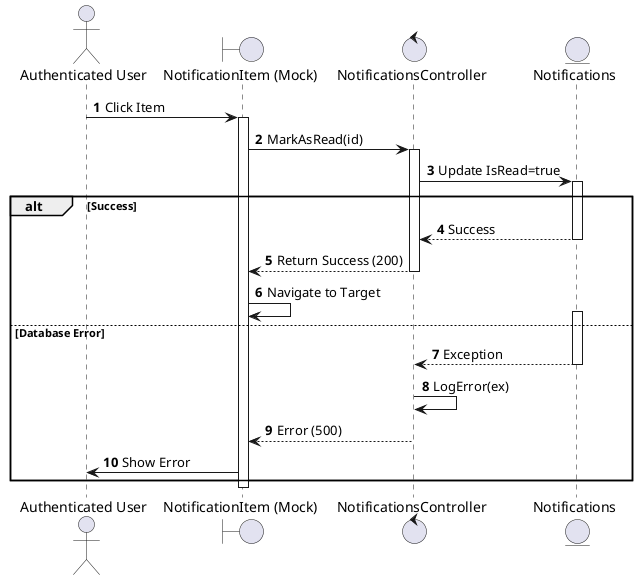
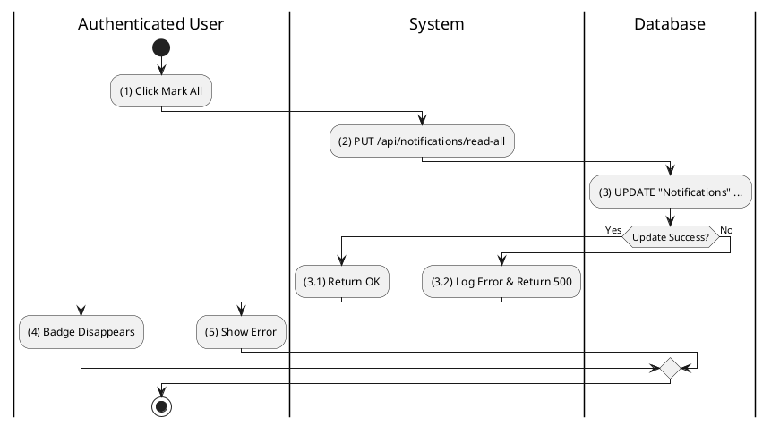
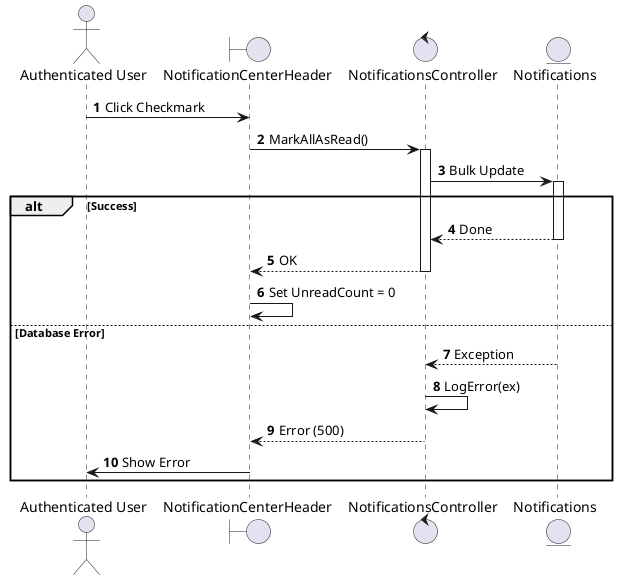
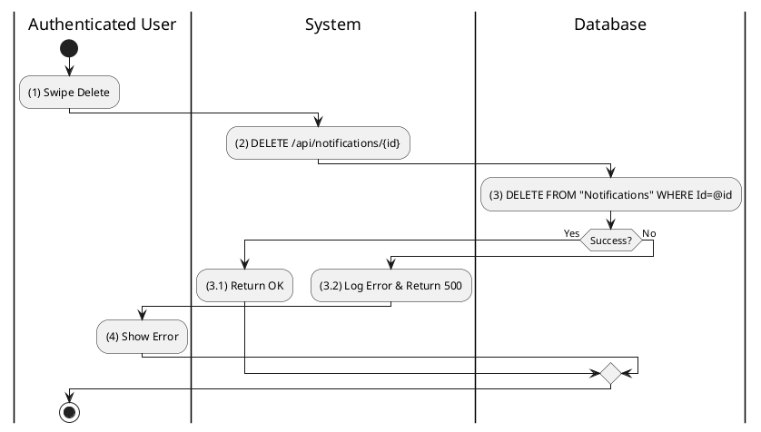
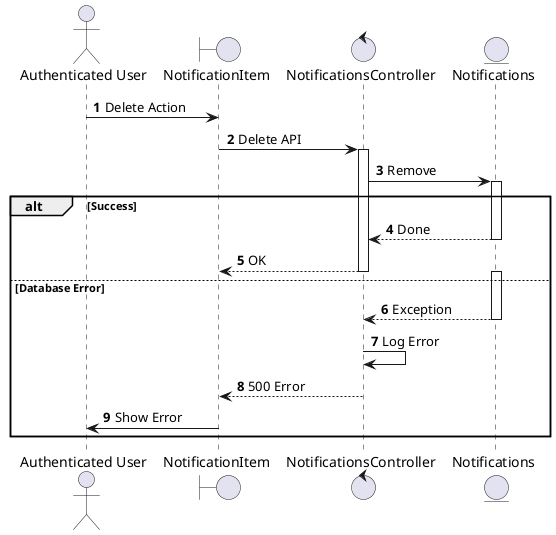
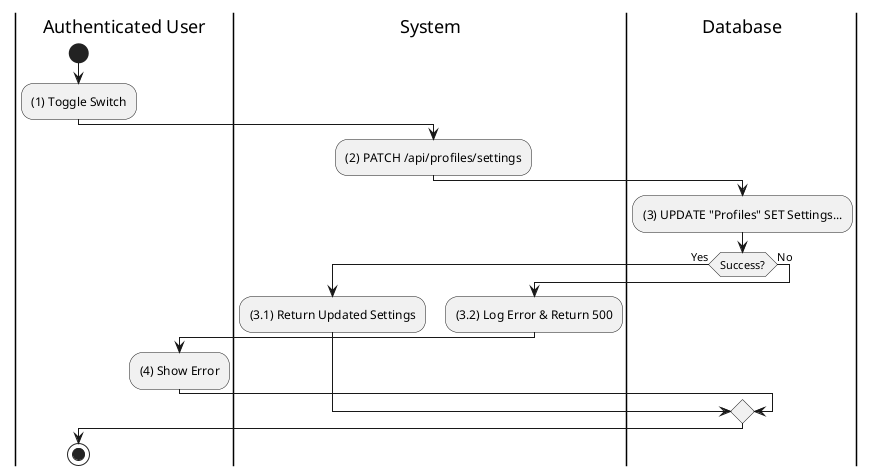
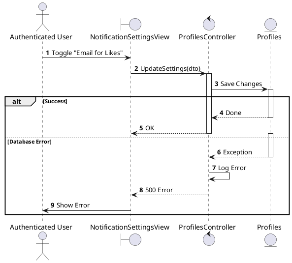

# Use Case 2.1.8: Monitor Notification

**Module**: Notifications
**Primary Actor**: Authenticated User
**Backend Controller**: `Favi_BE.API.Controllers.NotificationsController`
**Database Tables**: `"Notifications"`

---

## 2.1.8.1 Monitor Notification (Overview)

### Use Case Description
| Attribute | Details |
| :--- | :--- |
| **Name** | **Monitor Notification** |
| **Description** | Central hub for viewing and managing system alerts and notifications. |
| **Actor** | Authenticated User |
| **Trigger** | ❖ User clicks the "Bell" icon. |
| **Post-condition** | ❖ User views or manages notifications. |

### Business Rules (BR)

| Activity | BR Code | Description |
| :---: | :---: | :--- |
| (1) | BR1 | **Initialization:** ❖ The System fetches the user's notification stream, highlighting unread items. ❖ The System provides controls to Mark as Read, Delete, or Configure preferences. |

### Diagrams

**Activity Diagram**

**Sequence Diagram**

---

## 2.1.8.3 Mark Notification as Read

### Use Case Description
| Attribute | Details |
| :--- | :--- |
| **Name** | **Mark Notification as Read** |
| **Description** | Click a notification to read it. |
| **Actor** | Authenticated User |
| **Trigger** | ❖ User clicks on an unread notification item. |
| **Pre-condition** | ❖ Notification exists and is unread. |
| **Post-condition** | ❖ Notification status becomes "Read". ❖ User is redirected to the relevant content. |

### Business Rules (BR)

| Activity | BR Code | Description |
| :---: | :---: | :--- |
| (2)-(3) | BR1 | **Processing:** ❖ **Frontend**: `NotificationItem` onClick. Calls `notifyApi.markRead(id)`. ❖ **API**: `PUT /api/notifications/{id}/read`. ❖ **Backend**: `NotificationsController.MarkRead(id)`. ❖ **DB**: `UPDATE Notifications SET IsRead=1 WHERE Id=@id`. |
| (3.1)-(4) | BR2 | **Routing:** ❖ **Response**: `200 OK`. ❖ **Frontend**: Redirects `window.location` to `notification.targetUrl` (e.g. `/posts/{id}`). |
| (3.2)-(5) | BR_Error | **Exception:** ❖ **Error**: `500 Server Error`. Logged. ❖ **Frontend**: Shows error toast. |

### Diagrams

**Activity Diagram**

**Sequence Diagram**

---

## 2.1.8.4 Mark All Notifications as Read

### Use Case Description
| Attribute | Details |
| :--- | :--- |
| **Name** | **Mark All Notifications as Read** |
| **Description** | Bulk clear unread status. |
| **Actor** | Authenticated User |
| **Trigger** | ❖ User clicks the "Mark all as read" icon. |
| **Pre-condition** | ❖ There are unread notifications. |
| **Post-condition** | ❖ All user's notifications are updated to "Read". ❖ Badge count is reset to 0. |

### Business Rules (BR)

| Activity | BR Code | Description |
| :---: | :---: | :--- |
| (2)-(3) | BR1 | **Processing:** ❖ **Frontend**: `NotificationHeader` -> Click "Mark all read". Calls `notifyApi.markAllRead()`. ❖ **API**: `PUT /api/notifications/read-all`. ❖ **Backend**: `NotificationsController.MarkAllAsRead`. ❖ **DB**: `UPDATE Notifications SET IsRead=1 WHERE RecipientId=@currentUserId`. |
| (3.1)-(4) | BR2 | **Completion:** ❖ **Response**: `200 OK`. ❖ **Frontend**: Clears `unreadCount` badge in Redux. Resets UI badge to 0. |
| (3.2)-(5) | BR_Error | **Error:** ❖ **Server Error**: `500`. Logged via Serilog. ❖ **Frontend**: Displays "Failed to mark all as read". |

### Diagrams

**Activity Diagram**

**Sequence Diagram**

---

## 2.1.8.5 Delete Notification

### Use Case Description
| Attribute | Details |
| :--- | :--- |
| **Name** | **Delete Notification** |
| **Description** | Remove an item from history. |
| **Actor** | Authenticated User |
| **Trigger** | ❖ User uses the delete action/swipe on a notification. |
| **Pre-condition** | ❖ Notification exists in the list. |
| **Post-condition** | ❖ The notification record is deleted from the database. ❖ Item is removed from the UI. |

### Business Rules (BR)

| Activity | BR Code | Description |
| :---: | :---: | :--- |
| (2)-(3) | BR1 | **Processing:** ❖ **Frontend**: Swipe/Click Delete. Calls `notifyApi.delete(id)`. ❖ **API**: `DELETE /api/notifications/{id}`. ❖ **Backend**: `NotificationsController.Delete(id)`. ❖ **DB**: `DELETE FROM Notifications WHERE Id=@id`. |
| (3.1) | BR2 | **Update:** ❖ **Response**: `200 OK`. ❖ **Frontend**: Removes item from list using `filter`. |
| (3.2)-(4) | BR_Error | **Error:** ❖ **Not Found**: `404` if ID invalid. ❖ **Server Error**: `500`. |

### Diagrams

**Activity Diagram**

**Sequence Diagram**

---

## 2.1.8.6 Configure Notification Preferences

### Use Case Description
| Attribute | Details |
| :--- | :--- |
| **Name** | **Configure Notification Preferences** |
| **Description** | Toggle types of alerts. |
| **Actor** | Authenticated User |
| **Trigger** | ❖ User navigates to Settings -> Notifications. |
| **Pre-condition** | ❖ User is logged in. |
| **Post-condition** | ❖ User's preference logic is updated in the database. |

### Business Rules (BR)

| Activity | BR Code | Description |
| :---: | :---: | :--- |
| (2)-(3) | BR1 | **Processing:** ❖ **Frontend**: Toggle Switch. Calls `profileApi.updateSettings(settingsDto)`. ❖ **API**: `PATCH /api/profiles/settings`. ❖ **Backend**: `ProfilesController.UpdateSettings`. ❖ **DB**: `UPDATE Profiles SET Settings = JSON_SET(Settings, '$.notifyLikes', @val) WHERE Id=@me`. |
| (3.1) | BR2 | **Completion:** ❖ **Response**: `200 OK` (Updated Settings). ❖ **Frontend**: Updates local state. Toast "Settings Saved". |
| (3.2)-(4) | BR_Error | **Error:** ❖ **Error**: `500`. ❖ **Frontend**: Reverts toggle switch. Shows error. |

### Diagrams

**Activity Diagram**

**Sequence Diagram**

