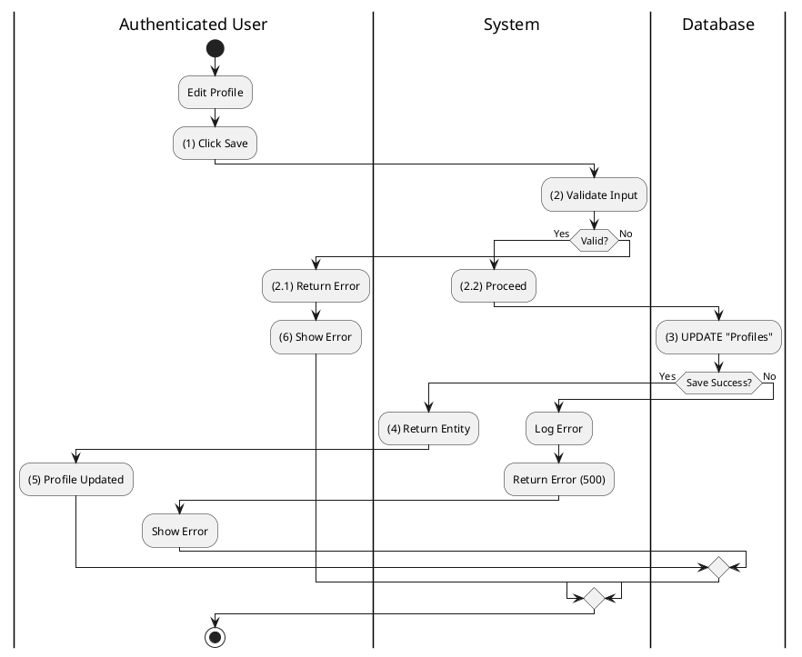
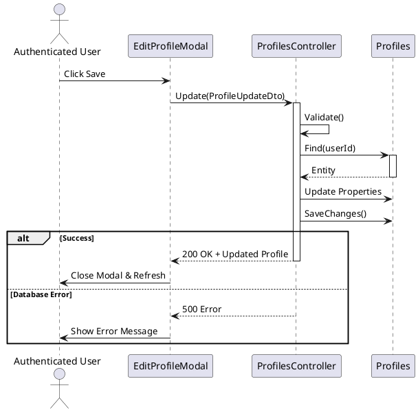
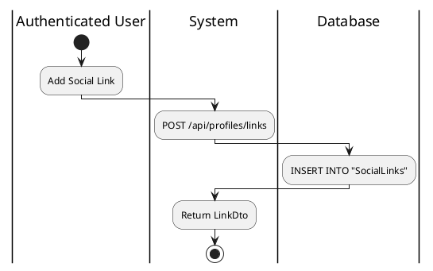
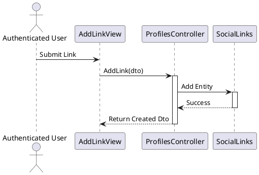
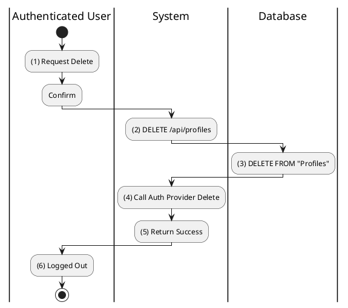
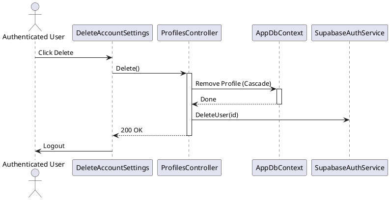

# Use Case 2.1.9: Adjust User Settings

**Module**: Settings / Profile
**Primary Actor**: Authenticated User
**Backend Controller**: `Favi_BE.API.Controllers.ProfilesController`
**Database Tables**: `"Profiles"`, `"SocialLinks"`

---

## 2.1.9.1 Adjust User Settings (Profile Update)

### Use Case Description
| Attribute | Details |
| :--- | :--- |
| **Name** | **Adjust User Settings (Profile Update)** |
| **Description** | Edit Bio, Name, or Avatar. |
| **Actor** | Authenticated User |
| **Trigger** | ❖ User clicks the "Edit Profile" button. |
| **Pre-condition** | ❖ User is logged in. |
| **Post-condition** | ❖ Profile information (Name, Bio, Avatar) is updated in the database. |

### Business Rules (BR)

| Activity | BR Code | Description |
| :---: | :---: | :--- |
| (1) | BR1 | **Submitting Rules:** When the user changes their details and clicks "Save" in the Edit Profile modal, the system initiates the update process. |
| (2) | BR2 | **Validation Rules:** The system validates the input data (e.g., Name length, valid URL formats). |
| (2.1) | BR2.1 | **Displaying Rules (Invalid):** If validation fails, the system returns a `400 Bad Request` and displays specific error messages to the user. |
| (2.2) | BR2.2 | **Processing Rules (Valid): If validation passes, the system proceeds to step (3) to persist the changes. |
| (3) | BR3 | **Storing Rules:** The database executes an `UPDATE` command on the `Profiles` table for the current user's record with the new values. |
| (4) | BR4 | **Displaying Rules:** The system returns the updated `Profile` entity/DTO. |
| (5) | BR5 | **Displaying Rules:** The UI updates the profile view with the new information and closes the modal (or shows a "Saved" toast). |
| (6) | BR6 | **Displaying Rules:** Show Error. |

### Diagrams

**Activity Diagram**

**Sequence Diagram**

---

## 2.1.9.3 Update Social Links

### Use Case Description
| Attribute | Details |
| :--- | :--- |
| **Name** | **Update Social Links** |
| **Description** | Add external links (Facebook, Twitter) to profile. |
| **Actor** | Authenticated User |
| **Trigger** | ❖ User clicks "Add Link" in profile settings. |
| **Pre-condition** | ❖ User has a valid URL to add. |
| **Post-condition** | ❖ New link is saved to "SocialLinks" table. ❖ Link appears on the user's public profile. |

### Business Rules (BR)

| Activity | BR Code | Description |
| :---: | :---: | :--- |
| (1) | BR1 | **Selecting Rules:** User clicks "Add Link" in the Edit Profile screen. |
| (2) | BR2 | **Displaying Rules:** System shows "Add Link" form: `[txtPlatform]`, `[txtUrl]`. |
| (3) | BR3 | **Submitting Rules:** User enters data and confirms. System calls `ProfilesController.AddLink(dto)`. |
| (4) | BR4 | **Storing Rules:** System inserts a new record into `"SocialLinks"` table with `ProfileId = @me`. |

### Diagrams

**Activity Diagram**

**Sequence Diagram**

---

## 2.1.9.5 Delete Account

### Use Case Description
| Attribute | Details |
| :--- | :--- |
| **Name** | **Delete Account** |
| **Description** | Permanent account removal. |
| **Actor** | Authenticated User |
| **Trigger** | ❖ User initiates deletion flow from Security Settings. |
| **Pre-condition** | ❖ User passes the confirmation challenge (e.g., typing "DELETE"). |
| **Post-condition** | ❖ All user data is permanently deleted from the database. ❖ Auth provider record is removed. |

### Business Rules (BR)

| Activity | BR Code | Description |
| :---: | :---: | :--- |
| (1) | BR1 | **Selecting Rules:** When the user clicks the "Delete Account" button in settings, the system asks for confirmation. |
| (2) | BR2 | **Processing Rules:** Upon confirmation, the system calls `ProfilesController.Delete` (`DELETE /api/profiles`). |
| (3) | BR3 | **Storing Rules:** The database permanently deletes the `Profiles` record (and cascades deletes to associated data like `Follows`, `UserConversations`). |
| (4) | BR4 | **Processing Rules:** The system calls the Authentication Provider (e.g., Auth0/Firebase) to remove the user's login identity. |
| (5) | BR5 | **Displaying Rules:** The system returns a success message indicating the account is deleted. |
| (6) | BR6 | **Displaying Rules:** The UI forcibly logs the user out and redirects them to the Landing/Login page. |

### Diagrams

**Activity Diagram**

**Sequence Diagram**

