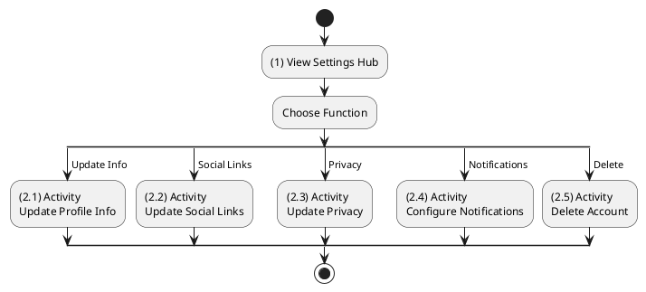
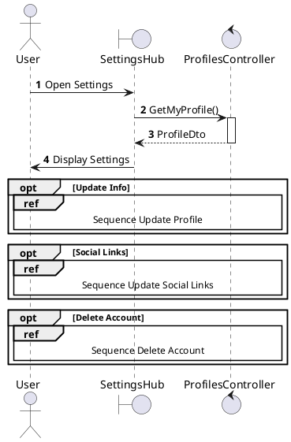
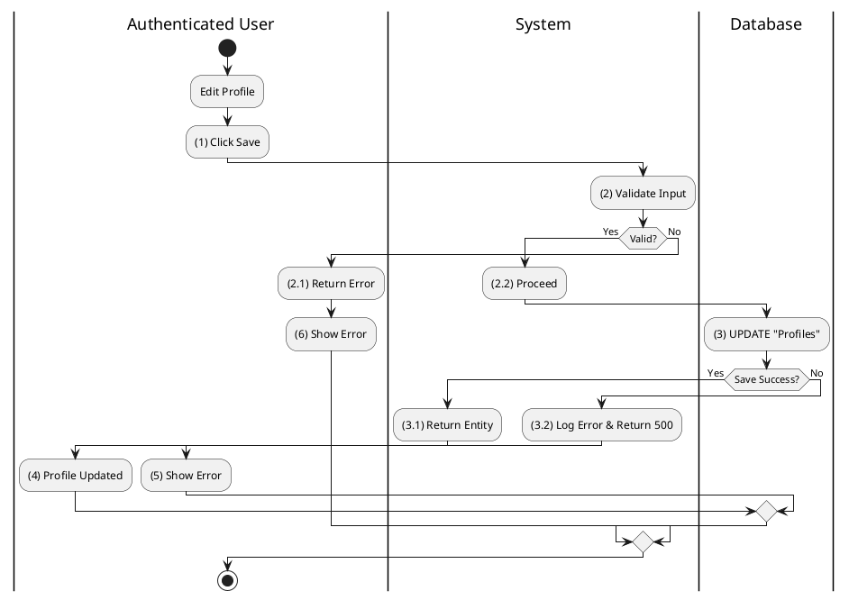
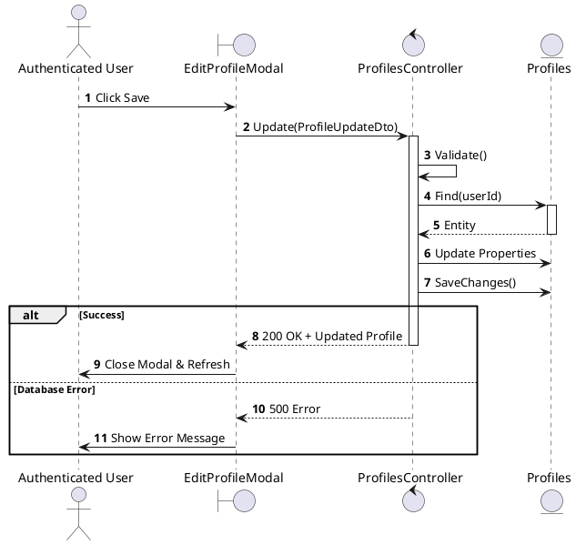
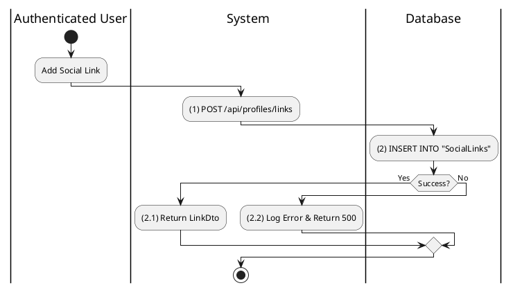
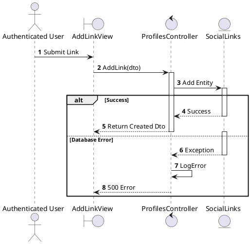
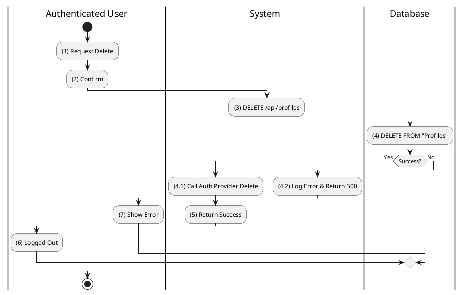
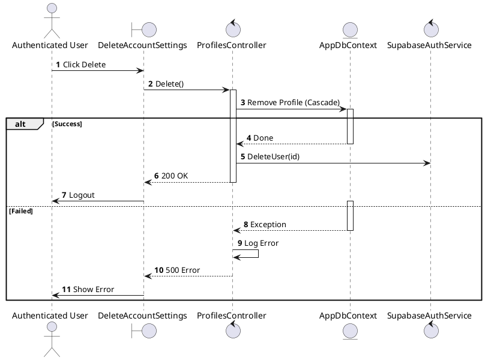

# Use Case 2.1.9: Adjust User Settings

**Module**: Settings / Profile
**Primary Actor**: Authenticated User
**Backend Controller**: `Favi_BE.API.Controllers.ProfilesController`
**Database Tables**: `"Profiles"`, `"SocialLinks"`

---

## 2.1.9.1 Adjust User Settings (Overview)

### Use Case Description
| Attribute | Details |
| :--- | :--- |
| **Name** | **Adjust User Settings** |
| **Description** | Central hub for managing profile details, account security, and preferences. |
| **Actor** | Authenticated User |
| **Trigger** | ❖ User enters the "Settings" or "Edit Profile" section. |
| **Post-condition** | ❖ User updates profile or account settings. |

### Business Rules (BR)

| Activity | BR Code | Description |
| :---: | :---: | :--- |
| (1) | BR1 | **Initialization:** ❖ The System fetches the current user's profile and settings. ❖ The System provides navigation to Update Profile, Social Links, Privacy, or Delete Account. |

### Diagrams

**Activity Diagram**

**Sequence Diagram**

---

## 2.1.9.2 Update Profile Information

### Use Case Description
| Attribute | Details |
| :--- | :--- |
| **Name** | **Update Profile Information** |
| **Description** | Edit Bio, Name, or Avatar. |
| **Actor** | Authenticated User |
| **Trigger** | ❖ User clicks the "Save" button on the Edit Profile form. |
| **Pre-condition** | ❖ User is logged in. |
| **Post-condition** | ❖ Profile information (Name, Bio, Avatar) is updated in the database. |

### Business Rules (BR)

| Activity | BR Code | Description |
| :---: | :---: | :--- |
| (2)-(2.1) | BR1 | **Validation:** ❖ **Frontend**: `yup` schema validation (Name required, Bio < 500 chars). ❖ **API**: `PUT /api/profiles` Body: `ProfileUpdateDto`. ❖ **Backend**: `ProfilesController.UpdateProfile(dto)` checks `ModelState.IsValid`.  **Invalid**: Returns `400 Bad Request`. |
| (2.2)-(3) | BR2 | **Processing:** ❖ **Service**: `_profiles.UpdateAsync(userId, dto)`. ❖ **DB**: `Profiles.Find(id)`. Update fields. `SaveChanges()`. |
| (3.1)-(4) | BR3 | **Completion:** ❖ **Response**: `200 OK` (ProfileDto). ❖ **Frontend**: Updates `userSlice`. Success Toast. |
| (3.2)-(5) | BR_Error | **Error:** ❖ **DB Error**: `500`. Logged. ❖ **Frontend**: Show error toast. |

### Diagrams

**Activity Diagram**

**Sequence Diagram**

---

## 2.1.9.3 Update Social Links

### Use Case Description
| Attribute | Details |
| :--- | :--- |
| **Name** | **Update Social Links** |
| **Description** | Add external links (Facebook, Twitter) to profile. |
| **Actor** | Authenticated User |
| **Trigger** | ❖ User clicks "Add Link" in profile settings. |
| **Pre-condition** | ❖ User has a valid URL to add. |
| **Post-condition** | ❖ New link is saved to "SocialLinks" table. ❖ Link appears on the user's public profile. |

### Business Rules (BR)

| Activity | BR Code | Description |
| :---: | :---: | :--- |
| (1)-(2) | BR1 | **Processing:** ❖ **Frontend**: `AddLinkModal` -> Submit. Calls `profileApi.addLink(dto)`. ❖ **API**: `POST /api/profiles/links`. ❖ **Backend**: `ProfilesController.AddLink`. ❖ **DB**: `INSERT INTO SocialLinks (ProfileId, Platform, Url)`. |
| (2.1) | BR2 | **Completion:** ❖ **Response**: `200 OK` (LinkDto). ❖ **Frontend**: Appends new link to list. Closes modal. |
| (2.2) | BR_Error | **Error:** ❖ **Validation**: Invalid URL -> `400`. ❖ **Server**: `500`. |

### Diagrams

**Activity Diagram**

**Sequence Diagram**

---

## 2.1.9.5 Delete Account

### Use Case Description
| Attribute | Details |
| :--- | :--- |
| **Name** | **Delete Account** |
| **Description** | Permanent account removal. |
| **Actor** | Authenticated User |
| **Trigger** | ❖ User initiates deletion flow from Security Settings. |
| **Pre-condition** | ❖ User passes the confirmation challenge (e.g., typing "DELETE"). |
| **Post-condition** | ❖ All user data is permanently deleted from the database. ❖ Auth provider record is removed. |

### Business Rules (BR)

| Activity | BR Code | Description |
| :---: | :---: | :--- |
| (1)-(2) | BR1 | **Validation:** ❖ **Frontend**: Prompt user to type "DELETE". Check string match. ❖ **API**: `DELETE /api/profiles`. |
| (3)-(4) | BR2 | **Processing:** ❖ **Backend**: `ProfilesController.Delete`. calls `_profiles.DeleteAsync`. ❖ **DB**: `Users.IsDeleted = 1` (Soft Delete) OR `DELETE FROM Profiles` (Hard Delete). |
| (4.1)-(6) | BR3 | **Cleanup:** ❖ **Auth Service**: `_supabase.DeleteUserAsync(userId)`. ❖ **Response**: `200 OK`. ❖ **Frontend**: `auth.signOut()`. Redirect `/`. |
| (4.2)-(7) | BR_Error | **Error:** ❖ **DB Error**: `500`. Logged. ❖ **Frontend**: "Failed to delete account". |

### Diagrams

**Activity Diagram**

**Sequence Diagram**

