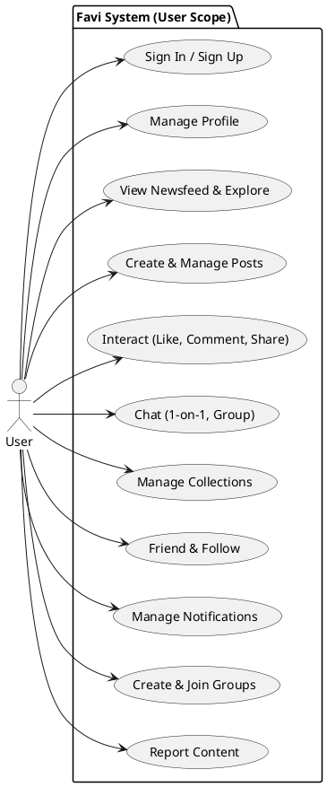
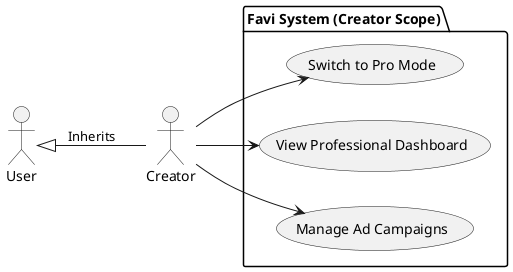
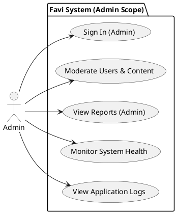

# Favi Use Case Diagrams

Here are the use case diagrams separated by actor.

## 1. User Use Cases (Regular User)

The core functionalities available to a standard user of the Favi social network.

## 2. Creator Use Cases (Professional)

Features available to Creators. Creators are Users who have switched to Professional Mode.

## 3. Admin Use Cases (Administrator)

Administrative functionalities for system management and moderation.

